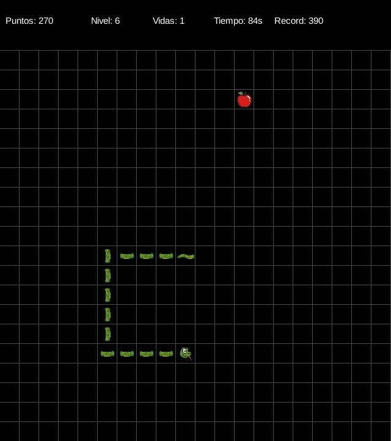

# 🐍 Serpiente - Juego creado con LibGDX

¡Bienvenida/o al clásico juego de la serpiente!
Ha sido reinventado por mí, con algunas variaciones...  
Este proyecto ha sido desarrollado con [LibGDX](https://libgdx.com/) y es compatible con Windows, Linux y macOS.

---



## 🎮 ¿Cómo se juega?

- Controla la serpiente con las teclas de dirección.
- Come manzanas para crecer. Verás que hay 2 tipos de manzana: la roja te sumará 10 puntos, la arcoiris te sumará 20 puntos.
- Cada 50 puntos, subes de nivel. Será fácil de reconocer ya que el fondo del juego cambiará de color.
- Evita chocar contra ti misma, ya que perderás una vida. Tienes 3 en total, así que cuando las pierdas te saldrá un mensaje de "Game Over". En este momento, si pulsas "espacio" iniciarás el juego de neuvo.
- Consigue la mejor puntuación posible. El HUD te avisará cuando hayas batido tu récord, cambiando a un color dorado y parpadeando.

---

## 📦 ¿Qué incluye?

- Código fuente completo en Java.
- Recursos gráficos personalizados.
- Ejecutable `.jar` listo para jugar.
- Soporte para empaquetado nativo con Construo.

---

## Tecnologías usadas:
- LibGDX
- Gradle
- Java
- Construo (para empaquetado nativo)

---

## Créditos:
Creado por mí, Montse Muñoz, desde un lugar de La Mancha de cuyo nombre sí quiero acordarme, pero no es de mayor interés para vosotros :)

--- 

## 🚀 Cómo ejecutar

1. Asegúrate de tener Java 8 o superior instalado.
2. Descarga el archivo `Serpiente-1.0.0.jar` desde la carpeta `lwjgl3/build/libs`.
3. Ejecuta con doble clic o desde la terminal:

```bash
java -jar Serpiente-1.0.0.jar

>>>>>>> 519043c6cf85fa942e4f5e3e3516c7d3d7e1e32e
